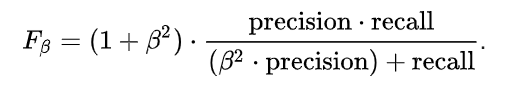
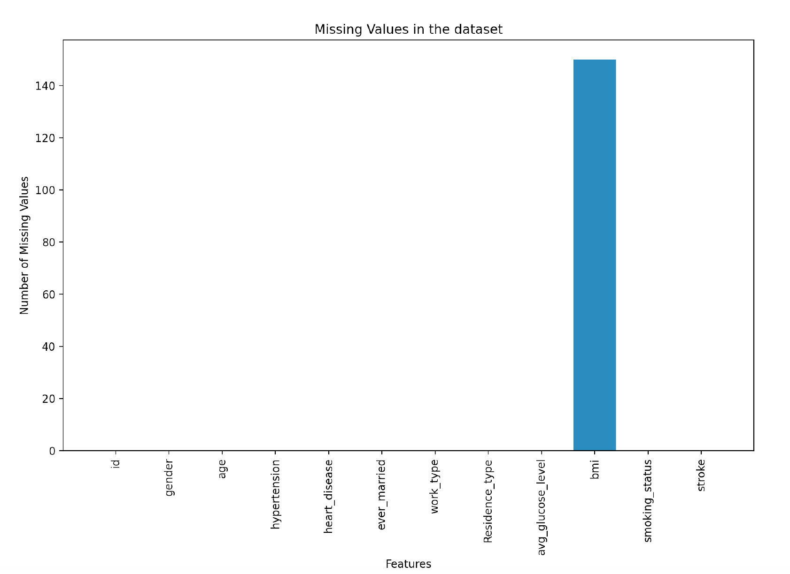
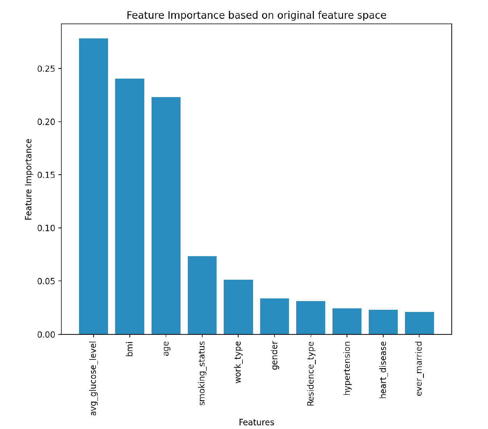
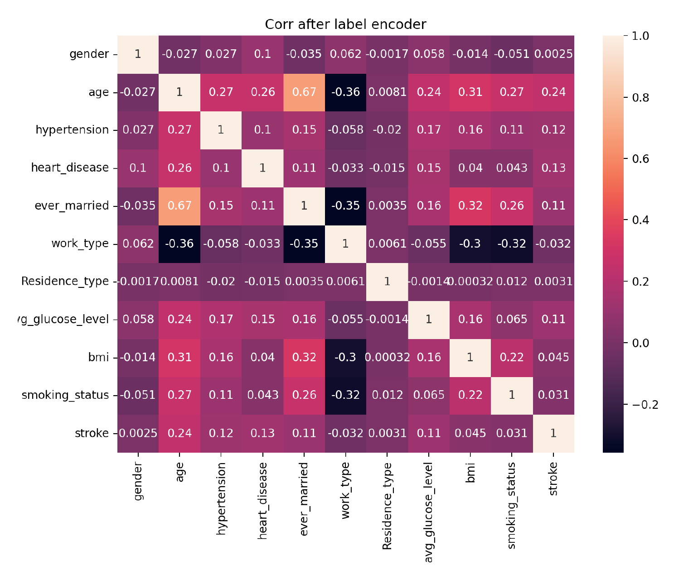

# Heart-Stroke-Prediction

<!-- TABLE OF CONTENTS -->

  
Table of Contents

  <ol>
    <li><a href="#about-the-project">About The Project</a></li>
    <li><a href="#contents">Contents</a></li>
    <li><a href="#screenshots">Screenshots</a></li>
    <li><a href="#built-with">Built With</a></li>
      <ul>
          <li><a href="#installation">Installation</a></li>
      </ul>
    <li><a href="#author">Author</a></li>
    <li><a href="#license">License</a></li>
  </ol>

## About The Project

In this project, I use the [Heart Stroke Prediction dataset from WHO](https://www.kaggle.com/fedesoriano/stroke-prediction-dataset) to predict the heart stroke. **In the Heart Stroke dataset, two class is totally imbalanced and heart stroke datapoints will be easy to ignore to compare with the no heart stroke datapoints.** Recall is very useful when you have to correctly classify some event that has already occurred and rarely happens. For example, cancer detection and fraud detection models must have a high recall in order to detect cancer and frauds properly. In such situations, we don't care about the real 0s (non-stroke, non-fraud), because we are interested only in spotting the real 1s (stroke, cancer, fraud, etc.) as often as possible.

The final result of my project got the highest rank among all teams and above the majority score.

## Contents

### Data EDA
- Data Info: The Heart Stroke dataset has 11 features and 1 binary output. The features include 4 integers, 2 float, and 5 categorical features. Training set has 3859 datapoints and Test set has 1251 datapoints.
- Missing Values: We could find that there are 150 missing values in the Training set and 51 missing values in the Test set.
- *Imbalance*: The Training set has 3676 non-stroke (95.2578%) and 183 stroke (4.7422%) datapoints, which the classes are totally imbalance.

### Preprocessing Pipeline
- Load Data 

- Exploratory Data Analysis and Data Visualization (missing value, categorical features, imbalance, correlation, feature important)  

- Data Scrubbing (with median value of bmi) 

- Data preprocessing (one hot encoding and Label encoding) 

- Training data split into train set and validation set, and set Test set aside to avoid Data snooping 

- Normalization on train, val, and test based on the training set 

- Deal with Imbalance (Oversampling/Undersampling) 

- Choose Evaluation Metrics and Model Selection (8 models) 

- Use GridSearchCV to tune the hyperparameters of selected models (first 4 better models among 8) 

- Change the threshold of probabilty to get the final validation prediction results

- Use Test set to predict final result.

### Metrics and Analysis
For measurements, I focus on the `Recall`, `Specificity`, `Sensitivity`, `f2 score (fbeta score with beta=2)` and `ROC AUC` of the stroke data, which has more weight on the stroke class, but not treat non-stroke and stroke data as two same weighted classes. Simply focus on the Accuracy, Precision and f1 score will lead to a very low recall and probabality all predicted as non-stroke (label 0). A stroke prediction system needs to focus on the stroke detection, not a very high accuracy cause by only detecting no stroke datapoints. 

ROC AUC uses true positive rate and false positive rate as the y-axis and x-axis, that should be useful to ignore the imbalanced class weight and measure the performance in a general case. Also, Specificity and Sensitivity are not influenced by the true probability of the class label as objective measurement metrics. For f1 and f2 score, the high precision low recall and low precision high recall will give us the same f1 score, but we just need the high recall one, thus f1 score should not be a good measurement for this dataset. F-beta score is the weighted harmonic mean of precision and recall, and recall is considered β times as important as precision. I choose F2 score which has a larger beta to compare with the f1 score, it has a higher weight on recall to compare with f1.
 

  

### Model Selection
##### Baseline Models
- Trivial Baseline model: Mode of the Train set label which should be all 0 (no stroke) for our dataset.
- Non-Trivial Baseline model: default 1-NN model
##### Models for Comparison 

## Screenshots
 

  
  
  
  

## Built With
- [Python 3.7.4](https://www.python.org/downloads/release/python-374/)

### Installation
This code built and tested with Python 3.7.4, included package scikit-learn 1.0.1, pandas 1.3.4, numpy 1.21.4, scipy 1.7.2, matplotlib 3.4.3, and seaborn 0.11.2.

## Reference
https://www.kaggle.com/dpaluszk/stroke-pred-struggling-with-lack-of-data-70-recall/notebook?scriptVersionId=60039314
https://www.kaggle.com/srajankumarshetty/strokeprediction-recall-as-performance-metrics/data
https://www.kaggle.com/alexkaggle95/stroke-risk-fbeta-and-recall-are-the-key/notebook
<!--## further improvement-->

## Author

**Shuai Xu** | University of Southern California

[Profile](https://github.com/sxu75374) - <a href="mailto:sxu75374@usc.edu?subject=Nice to meet you!&body=Hi Shuai!">Email</a>

Project Link: [https://github.com/sxu75374/Heart-Stroke-Prediction](https://github.com/sxu75374/Heart-Stroke-Prediction)

<!-- LICENSE -->
## License

Distributed under the MIT License. See `LICENSE.md` for more information.

[<a href="#top">back to top</a>]

